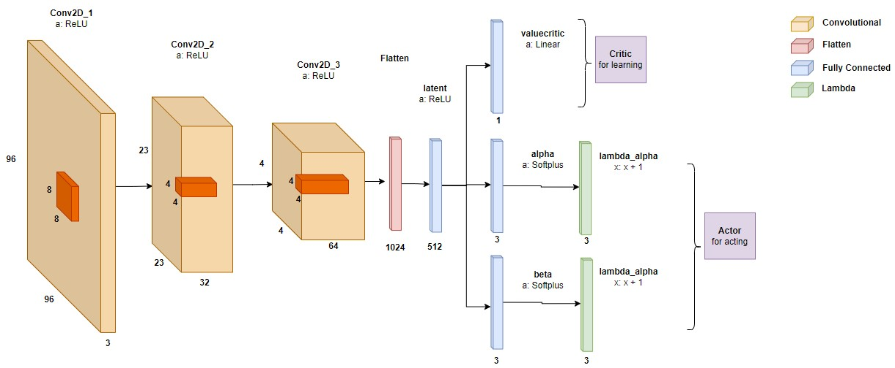

# Hyperparameter tuning of the PPOalgorithm for OpenAI’s CarRacing

Author: Vojtěch Sýkora

## Project Description

**Environment: CarRacing-v2**
https://www.gymlibrary.dev/environments/box2d/car_racing/

**Algorithm: Proximal Policy Optimization**
https://arxiv.org/abs/1707.06347

This project implemented the Proximal Policy Algorithm (PPO) on the CarRacing-v2 environment found in OpenAIs Gym library. The whole project description is available in the included PDF file.

Our ActorCritic Deep Neural Network was as follows:

## How to install the environment

(We used Anaconda, however any other package manager can be used)

Install Anaconda Distribution https://www.anaconda.com/products/distribution

*conda env create -f newest.yml*

*conda activate newest*

*python \<filename\>*

## How to run a saved model

Open *run_model.py* and change MODEL_PATH to the saved model path and then run:

*python run_model.py*

## How to train a model

Set hyperparameters in *my_parser.py* and run:

*python train_model.py*

Models with checkpoints will be save in args.models_dir (in my_parser.py variable models_dir) directory which is by default sewt to "models/".